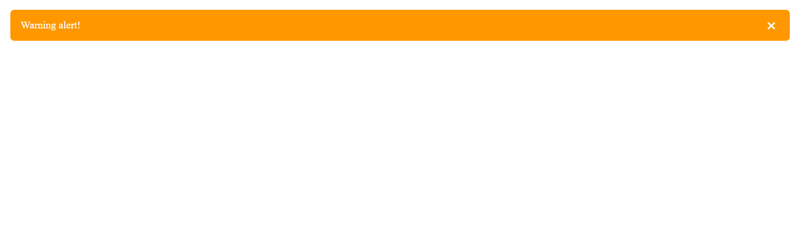

# React Component Library with Storybook

This project is a small reusable **React component library** built with **Vite**, **TypeScript**, and **Storybook**.  
It demonstrates how to create reusable UI components, visualize their states in Storybook, and document them with examples.

---

## 🚀 Setup Instructions

1. **Clone the repository**
   ```bash
   git clone https://github.com/AlexandraSavenko/test-task-story-book.git
   cd component-library
   ```
2. **Install dependencies**
   npm install
3. **Start the dev server**
   npm run dev
   4. **Run Storybook**
   npm run storybook
   5. **Build Storybook (for static deployment)**
   npm run build-storybook

   Components Overview

4. Input Component
   Supports different types (text, password, number)

Password visibility toggle (eye icon)

Optional clearable prop to show a clear button

Screenshots:

Text input

Password input with toggle

Number input

Clearable input

2. Toast Component
   Appears at the bottom right

Auto-dismiss after configurable duration

Supports different types (success, error, info, warning)

Optional manual close button

Screenshots:

Success toast

Error toast

Info toast

Warning toast

3. Sidebar Menu Component
   Slides in from the right

Supports nested submenus (accordion/expandable)

Closes when background is clicked

Screenshots:

Sidebar closed

Sidebar open with 1-level menu

Sidebar open with 2-level nested menu


- Password with toggle  


- Toaster


- Sidebar 

